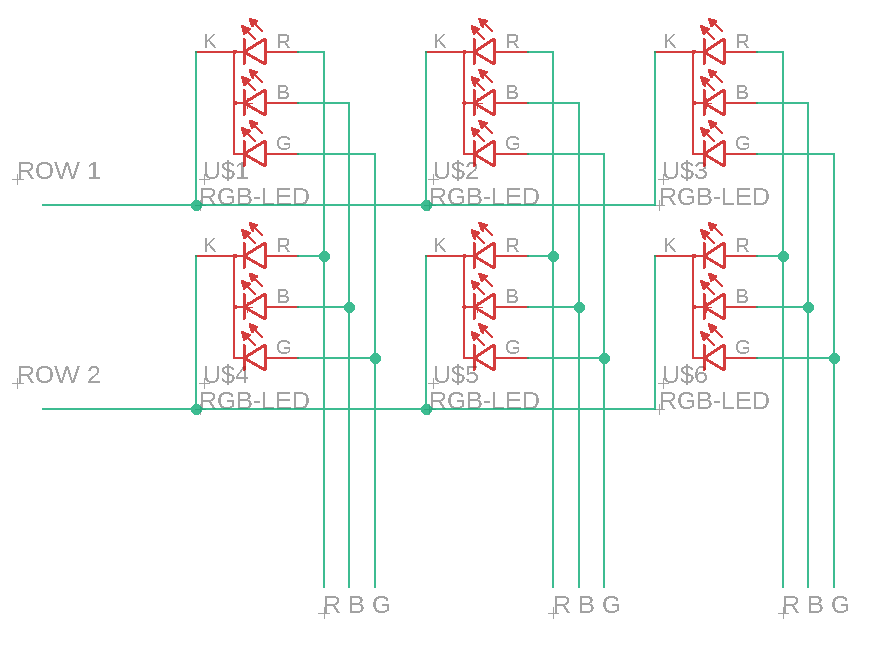

# The Idea of the WordClock
I see around the internet a lot of Word Clock very well made. 
BUT a lot of them are made with an adressable led strip. 
I think it's too easy to do so I decide to made one with a bunch of shift register found 
on an old board and a basic common cathode RGB leds.
The principle I want to use to control the matrix is the same used by a 7 segment display,
There are eleven row and eleven column, each column has eleven RGB leds connected, 
so there are 33 individual leds to control.
Initially I wanted to connect all the shift register in series so, without counting the 
reset and the chip select pin, I'd have only 2 pins to control, in order to use a ESP01.
But the code probably would have been too complicated.
my second idea is to connect the shift register in a sort of RGB configuration and 
I will use an ESP12 with more in/out pins.

# What I have 
* ESP12 on a NODEMCU V0.9
* 4x 74HC164N shift register
* 6X 74HC299N shift register
* Common Cathode RGB Clear LED

# The Matrix
In the matrix each row of leds will have the common cathode connected together,
instead each column will have the anode of each color connected together.
In the end I will have eleven row inputs and 33 column input (11 for color).
Markup : 

# The Shift Register
The six shift register will be connected in pair, 
each shift register has 8 bit output so for one row of led 
We will need only eleven of the in order to control all the column, 
the remaining one willi be used o control the row input of the matrix.

# Ver. 0.1
There are some example code and a first hardware scheme.
